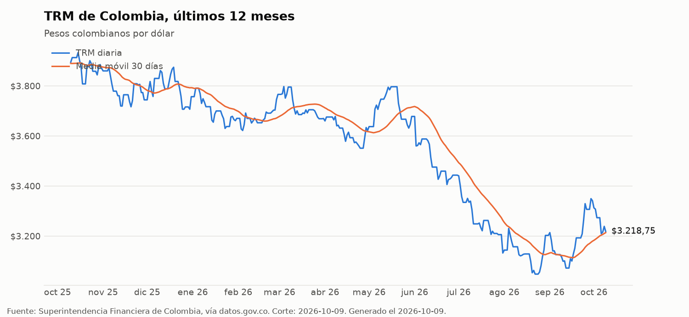
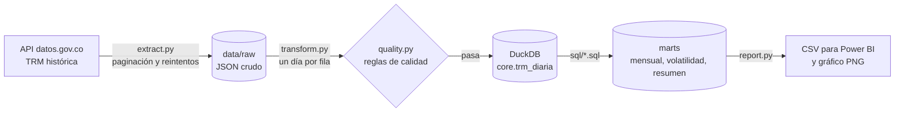

# Pipeline de datos: TRM de Colombia

[](https://github.com/KevinMoya200/trm-colombia-pipeline/actions/workflows/pipeline.yml)

Pipeline de punta a punta que descarga la Tasa Representativa del Mercado (TRM) que certifica la Superintendencia Financiera de Colombia y publica datos.gov.co, la valida, la carga en una bodega DuckDB, construye modelos en SQL y publica un gráfico y archivos CSV listos para Power BI. Corre solo cada semana con GitHub Actions.

**Stack:** Python, pandas, SQL, DuckDB, pytest, GitHub Actions y Power BI.



Resumen del último corte: [docs/resumen.md](docs/resumen.md)

## Qué hace



1. **Extrae** la serie completa, o solo lo nuevo, de la API Socrata de datos.gov.co, con paginación y reintentos con espera exponencial.
2. **Guarda el crudo** tal cual llegó, para poder reprocesar sin volver a llamar a la API.
3. **Transforma** cada vigencia en una fila por día. Un mismo valor puede regir de sábado a lunes, o más días si hay festivo, y la API lo entrega como un solo registro.
4. **Valida** antes de cargar: tabla no vacía, sin nulos, sin fechas duplicadas, valores en un rango plausible y dato reciente. Si algo falla, el pipeline se detiene. Los huecos en el calendario y los saltos de más de 10 % en un día quedan como alertas.
5. **Carga** en DuckDB con `INSERT OR REPLACE` por fecha. Correrlo dos veces con los mismos datos no duplica nada.
6. **Modela** en SQL: resumen mensual, volatilidad móvil de 20 días hábiles y un resumen con el valor actual, el rango de 52 semanas y la variación del año.
7. **Publica** los modelos en CSV y genera el gráfico de los últimos 12 meses.

## Modelos

| Tabla | Grano | Qué tiene |
| --- | --- | --- |
| `core.trm_diaria` | un día | TRM vigente en cada día del calendario |
| `marts.trm_mensual` | un mes | promedio, mínimo, máximo, apertura, cierre y variación contra el mes anterior |
| `marts.trm_volatilidad` | un día hábil | cambio diario en % y su desviación estándar móvil de 20 días |
| `marts.trm_resumen` | una fila | valor actual, mínimo y máximo de 52 semanas y variación del año |

## Decisiones de diseño

- **DuckDB como bodega.** Es analítica, no necesita servidor y vive en un archivo. Para este volumen alcanza de sobra, y el SQL se puede llevar a PostgreSQL o a una bodega en la nube con pocos cambios.
- **Carga incremental con solapamiento.** En corridas locales solo se piden las vigencias recientes, con 7 días hacia atrás por si hubo correcciones. El upsert por fecha hace que repetir una carga sea seguro.
- **Calidad antes de cargar.** Un dato malo que entra a la bodega termina en un reporte. Por eso las reglas duras detienen el pipeline.
- **SQL en archivos versionados.** Cada modelo es un `.sql` que se ejecuta en orden. Es la misma idea de dbt, sin agregar la dependencia.
- **GitHub Actions como orquestador.** Corre las pruebas y el pipeline cada lunes y en cada push, y sube el gráfico y los CSV actualizados.

## Cómo correrlo

```bash
python -m venv .venv
source .venv/bin/activate        # en Windows: .venv\Scripts\activate
pip install -r requirements.txt

python -m pipeline.run --full-refresh   # primera vez: trae toda la historia
python -m pipeline.run                  # siguientes veces: solo lo nuevo
python -m pipeline.run --sample         # sin internet, con datos sintéticos
pytest -q                               # pruebas
```

## Conectarlo a Power BI

En Power BI Desktop: **Obtener datos > Web** y pega la URL "Raw" de cualquiera de estos archivos:

- `output/trm_mensual.csv`
- `output/trm_volatilidad.csv`
- `output/trm_resumen.csv`

Como GitHub Actions los actualiza cada semana, el tablero se refresca con la misma URL.

## Estructura

```
pipeline/   extracción, transformación, calidad, carga y reportes
sql/        modelos en SQL, en orden de ejecución
tests/      pruebas con pytest y datos sintéticos
output/     CSV generados por el pipeline
docs/       gráfico y resumen generados por el pipeline
.github/    flujo de GitHub Actions
```

## Próximos pasos

- Orquestar con Airflow o Prefect en lugar de GitHub Actions.
- Pasar los modelos a dbt, con pruebas de datos declarativas.
- Llevar la bodega a la nube (BigQuery, Snowflake o Microsoft Fabric).
- Sumar otras series del Banco de la República y cruzarlas con la TRM.

## Fuente de los datos

TRM histórica certificada por la Superintendencia Financiera de Colombia y publicada como datos abiertos en datos.gov.co (conjunto `mcec-87by`). Es un proyecto personal de portafolio, sin relación con la Superintendencia ni con datos.gov.co.

## Autor

Kevin Daniel Moya Gómez | [LinkedIn](https://www.linkedin.com/in/kevinmoyagomez)
